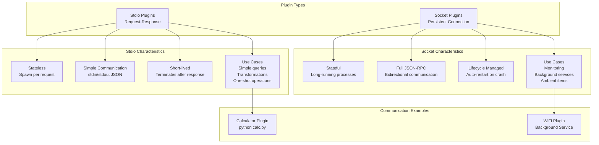
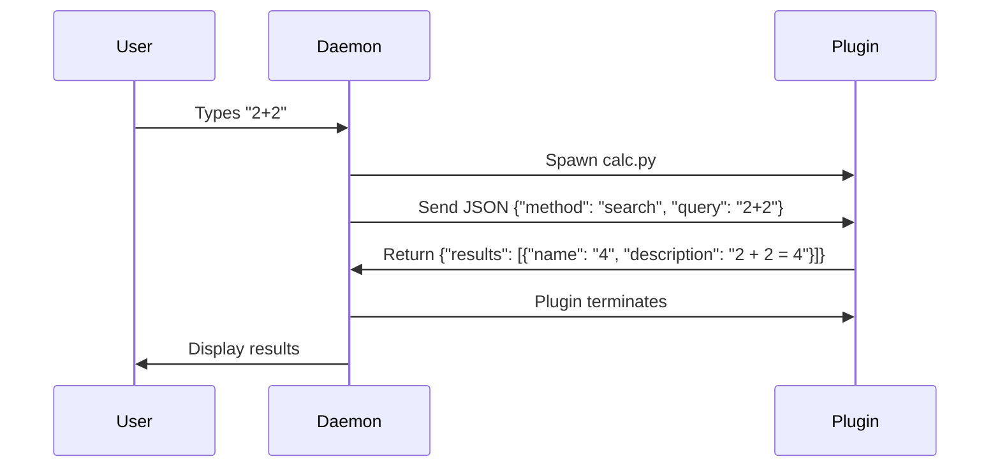
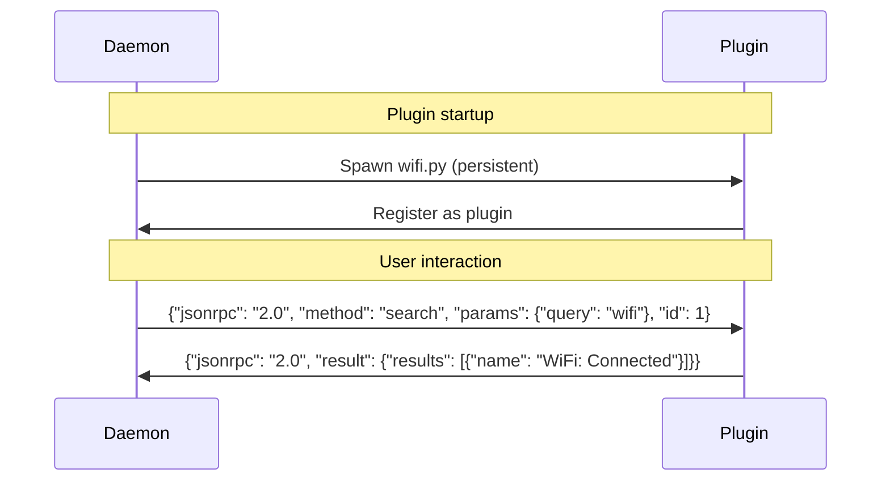
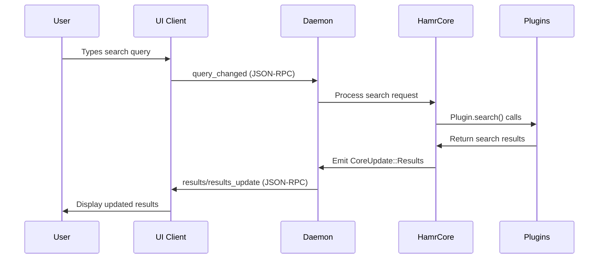
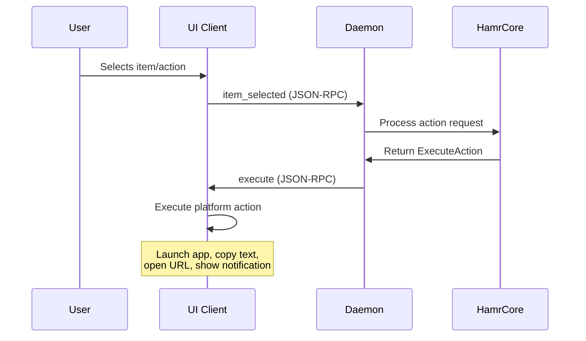
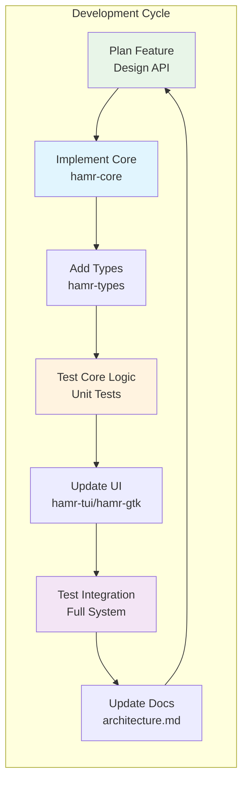
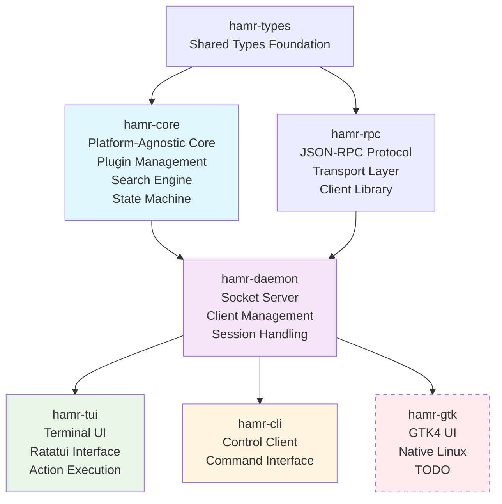

# Software Architecture

Hamr is a fast, extensible desktop launcher built with Rust, featuring a client-server architecture with native UI implementations.

## System Overview

```mermaid
graph TB
    subgraph "UI Layer"
        TUI[hamr-tui<br/>TUI + Ratatui]
        GTK[hamr-gtk<br/>GTK4 + Layer Shell]
        Future[(future)<br/>macOS/Windows]
    end

    subgraph "Communication Layer"
        RPC[JSON-RPC 2.0 over Unix Socket]
    end

    subgraph "Daemon Layer"
        Daemon[hamr-daemon<br/>Socket Server]
        Core[HamrCore<br/>State Machine<br/>Search, Plugins, Index]
        PluginMgr[Plugin Manager<br/>Spawning & IPC]
    end

    subgraph "Plugin Registry"
        Discovered[Discovered Plugins<br/>• stdio<br/>• socket spawned]
        Registered[Registered Plugins<br/>• External services<br/>• Spawned sockets]
    end

    subgraph "Example Plugins"
        Apps[apps<br/>stdio<br/>spawn/req]
        Calc[calc<br/>stdio<br/>spawn/req]
        Wifi[wifi<br/>socket<br/>daemon]
    end

    TUI --> RPC
    GTK --> RPC
    Future --> RPC

    RPC --> Daemon
    Daemon --> Core
    Daemon --> PluginMgr

    Core --> PluginMgr
    PluginMgr --> Discovered
    PluginMgr --> Registered

    Registered --> Apps
    Registered --> Calc
    Registered --> Wifi
```

## Core Components

```mermaid
graph TB
    subgraph "Core Components"
        Core[HamrCore<br/>Platform-Agnostic Core]
        Daemon[HamrDaemon<br/>Socket Server]
        TUI[HamrTUI<br/>Terminal UI]
        GTK[HamrGTK<br/>Native Linux UI<br/>Planned]
        CLI[HamrCLI<br/>Control Client]
    end

    subgraph "HamrCore Responsibilities"
        Plugin[Plugin Management<br/>Discovery, Spawning, Lifecycle]
        Search[Search Engine<br/>Nucleo Fuzzy Matching<br/>Frecency Ranking]
        Index[Index Storage<br/>Disk Persistence<br/>Incremental Updates]
        Config[Configuration<br/>XDG Loading<br/>Hot-Reload]
        State[State Machine<br/>CoreEvent → CoreUpdate]
    end

    subgraph "HamrDaemon Responsibilities"
        Socket[Unix Socket Server<br/>JSON-RPC 2.0<br/>Length-Prefixed Framing]
        Clients[Client Management<br/>UI, Control, Plugin]
        Registry[Plugin Registry<br/>Merge Discovered + Registered]
        Session[Session Handling<br/>Single Active UI]
        Watch[Config Watching<br/>Filesystem Monitoring]
    end

    subgraph "UI Client Features"
        TUI_F[TUI Features<br/>Ratatui Interface<br/>Keyboard Navigation<br/>Compositor Integration<br/>Action Execution]
        GTK_F[GTK Features<br/>GTK4 + Layer Shell<br/>Material Design 3<br/>Multi-Monitor]
        CLI_F[CLI Features<br/>Control Operations<br/>Toggle/Show/Hide<br/>Plugin Management]
    end

    Core --> Plugin
    Core --> Search
    Core --> Index
    Core --> Config
    Core --> State

    Daemon --> Socket
    Daemon --> Clients
    Daemon --> Registry
    Daemon --> Session
    Daemon --> Watch

    TUI --> TUI_F
    GTK --> GTK_F
    CLI --> CLI_F
```



## Plugin System

Hamr supports two plugin architectures for different use cases:



### Stdio Plugin Example



### Socket Plugin Example



## Data Flow

### Search Flow



### Action Execution



## Key Design Principles

### 1. Platform Agnostic Core

- **No I/O in core**: Actions are data structures, not execution
- **UI owns execution**: Platform-specific APIs (launch, copy, notify)
- **Type safety**: Zero runtime type coercion with comprehensive Rust types

### 2. Plugin-First Architecture

- **Extensible by design**: All features implemented as plugins
- **Two plugin types**: Stdio for simple, socket for complex
- **Registry merging**: Socket plugins can override discovered ones

### 3. Event-Driven Communication

- **JSON-RPC 2.0**: Industry standard protocol
- **Length-prefixed framing**: Reliable message boundaries
- **Multi-client support**: Single daemon serves all clients

### 4. Performance Focus

- **Nucleo fuzzy search**: State-of-the-art matching algorithm
- **Frecency scoring**: Usage patterns + time decay
- **Incremental indexing**: Only update changed items
- **Hot config reload**: No restart required

## Contributing

### Understanding the Architecture

When contributing to Hamr, keep these principles in mind:

1. **Core stays pure**: Business logic only, no platform code
2. **UI executes actions**: Core defines what, UI decides how
3. **Plugins are first-class**: New features should be plugins
4. **Type safety everywhere**: Use Rust's type system extensively
5. **Test core logic**: Unit tests for all business logic

### Development Workflow



```bash
# Work on core logic
cd crates/hamr-core
cargo test                    # Run core tests
cargo test specific_test      # Run single test

# Work on daemon
cd crates/hamr-daemon
cargo run                     # Start daemon

# Work on TUI (separate terminal)
cd crates/hamr-tui
cargo run                     # Start TUI client

# Check everything compiles
cargo check --workspace
```

### Adding New Features

1. **Core logic first**: Implement in `hamr-core` with tests
2. **Type definitions**: Add to `hamr-types` if shared
3. **UI integration**: Update UI clients to handle new types
4. **Documentation**: Update this guide and API docs

### Plugin Development

1. **Choose plugin type**: Stdio for simple, socket for complex
2. **Manifest first**: Define capabilities in `manifest.json`
3. **Protocol compliance**: Follow JSON protocol specification
4. **Error handling**: Graceful failure with meaningful messages

## Crate Structure

### Dependency Graph



This architecture enables Hamr to be fast, extensible, and maintainable while supporting multiple platforms and UI implementations.