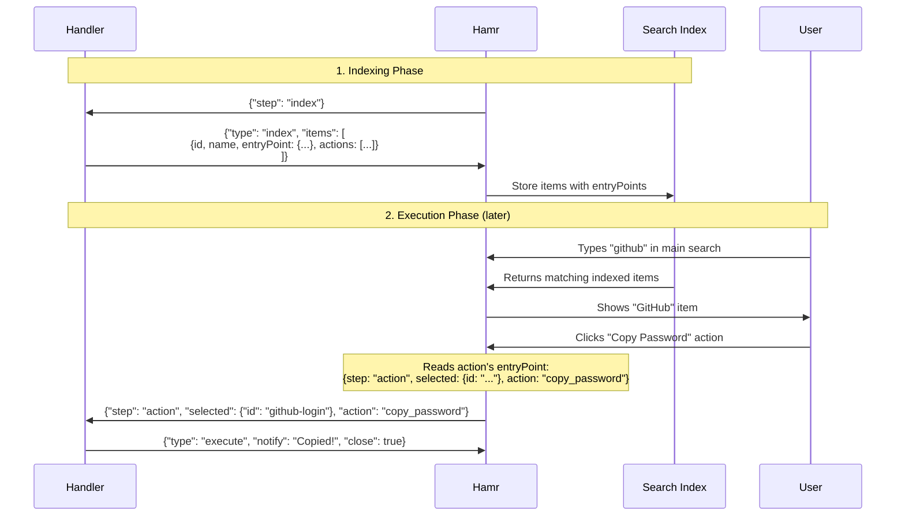
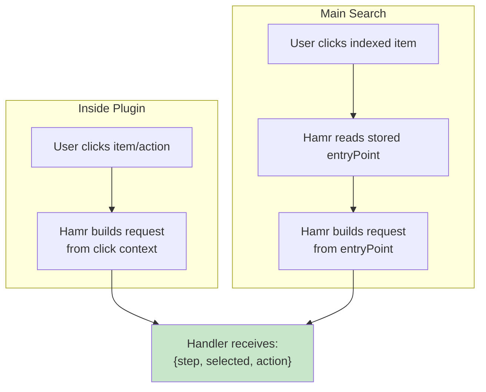

# Advanced Features

This page covers daemon mode, plugin indexing, status badges, FAB override, and ambient items.

## Daemon Mode

For plugins that need live updates, file watching, or persistent state, use daemon mode instead of spawning a new process for each request.

### Enable in Manifest

```json
{
  "name": "My Plugin",
  "daemon": {
    "enabled": true,
    "background": false
  }
}
```

| Field | Type | Default | Description |
|-------|------|---------|-------------|
| `enabled` | bool | false | Enable daemon mode |
| `background` | bool | false | Run always (true) or only when plugin open (false) |

### Daemon Lifecycle

- **`background: false`** - Starts when plugin opens, stops when it closes. Use for live displays (process monitors, media players).
- **`background: true`** - Starts when hamr launches, runs always. Use for file watching, status updates (todo counts, clipboard).

### Daemon Handler Pattern

```python
#!/usr/bin/env python3
import json
import os
import signal
import select
import sys
import time

def emit(data):
    """Emit JSON response (line-buffered)."""
    print(json.dumps(data), flush=True)

def main():
    # Graceful shutdown
    signal.signal(signal.SIGTERM, lambda s, f: sys.exit(0))
    signal.signal(signal.SIGINT, lambda s, f: sys.exit(0))
    
    current_query = ""
    last_refresh = 0
    refresh_interval = 2.0
    
    while True:
        # Non-blocking stdin read with timeout
        readable, _, _ = select.select([sys.stdin], [], [], 0.5)
        
        if readable:
            line = sys.stdin.readline()
            if not line:
                break  # EOF - hamr closed connection
            
            try:
                request = json.loads(line.strip())
            except json.JSONDecodeError:
                continue
            
            step = request.get("step", "")
            
            if step == "initial":
                current_query = ""
                emit({
                    "type": "results",
                    "results": get_results(),
                    "placeholder": "Search..."
                })
                last_refresh = time.time()
                continue
            
            if step == "search":
                current_query = request.get("query", "")
                emit({
                    "type": "results",
                    "results": get_results(current_query)
                })
                last_refresh = time.time()
                continue
            
            if step == "action":
                # Handle actions...
                emit({"type": "results", "results": get_results(current_query)})
                continue
        
        # Periodic refresh
        now = time.time()
        if now - last_refresh >= refresh_interval:
            emit({
                "type": "results",
                "results": get_results(current_query)
            })
            last_refresh = now

if __name__ == "__main__":
    main()
```

### Key Differences from Request-Response

| Aspect | Request-Response | Daemon |
|--------|-----------------|--------|
| Process lifecycle | New per request | Single persistent |
| stdin | `json.load(sys.stdin)` | `readline()` in loop |
| stdout | Single print | Multiple `emit()` calls |
| State | Stateless | Persistent variables |
| Updates | On user action | Can push anytime |

### File Watching with inotify

For efficient file watching, use native inotify:

```python
import ctypes
import ctypes.util
import struct

IN_CLOSE_WRITE = 0x00000008
IN_MOVED_TO = 0x00000080
IN_CREATE = 0x00000100

def create_inotify_fd(watch_path):
    """Create inotify fd watching a directory."""
    try:
        libc = ctypes.CDLL(ctypes.util.find_library("c"), use_errno=True)
        fd = libc.inotify_init()
        if fd < 0:
            return None
        
        watch_path.mkdir(parents=True, exist_ok=True)
        mask = IN_CLOSE_WRITE | IN_MOVED_TO | IN_CREATE
        wd = libc.inotify_add_watch(fd, str(watch_path).encode(), mask)
        if wd < 0:
            os.close(fd)
            return None
        return fd
    except Exception:
        return None

# Use in main loop
inotify_fd = create_inotify_fd(DATA_DIR)
if inotify_fd:
    while True:
        readable, _, _ = select.select([sys.stdin, inotify_fd], [], [], 1.0)
        # Handle stdin and inotify events...
```

**Example plugins:** [`topcpu/`](../../plugins/topcpu/), [`todo/`](../../plugins/todo/), [`clipboard/`](../../plugins/clipboard/)

---

## Plugin Indexing

Make your plugin's items searchable from the main launcher without opening the plugin.

### Enable in Manifest

```json
{
  "name": "Apps",
  "index": {
    "enabled": true
  }
}
```

Indexing requires daemon mode - the daemon emits `{"type": "index"}` responses whenever data changes.

### Handle the `index` Step

```python
if step == "index":
    print(json.dumps({
        "type": "index",
        "items": [
            {
                "id": "app:firefox",
                "name": "Firefox",
                "description": "Web Browser",
                "icon": "firefox",
                "iconType": "system",
                "keywords": ["browser", "web"],
                "verb": "Open",
                "execute": {
                    "launch": "/usr/share/applications/firefox.desktop"
                }
            }
        ]
    }))
    return
```

### Index Item Fields

| Field | Type | Required | Description |
|-------|------|----------|-------------|
| `id` | string | Yes | Unique identifier |
| `name` | string | Yes | Display name (searchable) |
| `description` | string | No | Subtitle |
| `icon` | string | No | Icon name |
| `iconType` | string | No | `"material"` or `"system"` |
| `keywords` | array | No | Additional search terms |
| `verb` | string | No | Action text (e.g., "Open") |
| `entryPoint` | object | Yes | How to invoke the handler (see below) |
| `actions` | array | No | Secondary action buttons |

### Understanding `entryPoint`

**`entryPoint` is only needed for indexed items** - items that appear in main search outside your plugin.

When a user selects an indexed item from main search, hamr has no context about your plugin. The `entryPoint` is a stored "recipe" that tells hamr what request to send to your handler.

**When `entryPoint` is needed:**

| Scenario | `entryPoint` needed? |
|----------|---------------------|
| Plugin without indexing (`index.enabled: false`) | No |
| Result items inside an active plugin | No |
| Index items (appear in main search) | Yes |

For most simple plugins without indexing, you never need `entryPoint`.

### `entryPoint` Schema

| Field | Type | Default | Description |
|-------|------|---------|-------------|
| `step` | string | `"action"` | Step type to send to handler |
| `selected` | object | - | Selected item info, usually `{"id": "..."}` |
| `action` | string | - | Which action to perform |
| `query` | string | - | Query string (for search-based entry points) |

### `entryPoint` vs `action`

| Concept | What it is | Example |
|---------|------------|---------|
| `entryPoint` | Blueprint/recipe for invoking the handler | `{"step": "action", "selected": {"id": "x"}, "action": "copy"}` |
| `action` | String identifier for which operation | `"copy"`, `"delete"`, `"edit"` |

### Full Indexing Flow

The complete flow from indexing to execution:



**Key points:**

1. **Handler provides `entryPoint`** - Hamr doesn't construct it automatically
2. **Hamr stores `entryPoint`** - Saved with indexed items for later use
3. **Handler receives standard request** - Same format as inside-plugin clicks

### Inside Plugin vs Main Search

The handler receives the same request format regardless of origin:



**Inside plugin:** Hamr builds the request directly - no `entryPoint` needed in result items.

**From main search:** Hamr uses the stored `entryPoint` from the index response.

**Handler logic is identical for both:**

```python
if step == "action":
    item_id = selected.get("id")
    action = input_data.get("action", "")
    
    if action == "copy_password":
        # User clicked the "Copy Password" button
        pass
    else:
        # User clicked the item itself (default action)
        pass
```

### Index Item Example

The handler must provide `entryPoint` on index items and their actions:

```python
{
    "id": "github-login",
    "name": "GitHub",
    "icon": "key",
    "entryPoint": {                          # Required: default click
        "step": "action",
        "selected": {"id": "github-login"}
    },
    "actions": [
        {
            "id": "copy_password",
            "name": "Copy Password",
            "icon": "key",
            "entryPoint": {                  # Required: action button click
                "step": "action",
                "selected": {"id": "github-login"},
                "action": "copy_password"
            }
        }
    ]
}
```

**Why the handler must provide `entryPoint`:**

- Hamr doesn't know what `step` to use (could be `"action"`, `"search"`, etc.)
- Hamr doesn't know what fields `selected` should contain
- Hamr doesn't know what `action` string maps to each button

### Index-Only Plugins

For plugins that only provide indexed items (no interactive mode), set `indexOnly: true` and use a daemon handler to emit index responses:

```json
{
  "name": "Zoxide",
  "description": "Jump to directories",
  "icon": "folder_special",
  "supportedCompositors": ["*"],
  "indexOnly": true,
  "daemon": {
    "enabled": true,
    "background": true
  }
}
```

The daemon handler emits `index` responses but returns an error for interactive steps.

### Incremental Indexing

For efficient updates with large datasets:

```python
if step == "index":
    mode = input_data.get("mode", "full")
    indexed_ids = set(input_data.get("indexedIds", []))
    
    if mode == "incremental" and indexed_ids:
        current_items = get_all_items()
        current_ids = {item["id"] for item in current_items}
        
        new_items = [i for i in current_items if i["id"] not in indexed_ids]
        removed_ids = list(indexed_ids - current_ids)
        
        print(json.dumps({
            "type": "index",
            "mode": "incremental",
            "items": new_items,
            "remove": removed_ids
        }))
    else:
        print(json.dumps({
            "type": "index",
            "items": get_all_items()
        }))
```

**Example plugins:** [`apps/`](../../plugins/apps/), [`bitwarden/`](../../plugins/bitwarden/)

---

## Search Ranking

Understanding how Hamr ranks search results helps you optimize your plugin's index items for discoverability.

### Ranking Algorithm

Hamr combines multiple signals to rank results:

```
composite_score = fuzzy_score + exact_match_bonus + frecency_boost + history_boost
```

| Signal | Weight | Description |
|--------|--------|-------------|
| **Fuzzy Score** | 0-1000 | Base relevance from fuzzysort matching |
| **Exact Match** | +500 | Query exactly matches item name |
| **Frecency** | 0-300 | Usage frequency × recency multiplier |
| **History Term** | +200 | Query matches a learned search term |

### Frecency Calculation

Frecency combines usage count with recency decay:

```
frecency = count × recency_multiplier
```

| Time Since Last Use | Multiplier |
|---------------------|------------|
| < 1 hour | 4× |
| < 24 hours | 2× |
| < 7 days | 1× |
| > 7 days | 0.5× |

### Diversity (Decay)

To prevent a single plugin from dominating results, Hamr applies exponential decay to consecutive results from the same plugin:

```
effective_score = composite_score × (decay_factor ^ position_in_plugin)
```

With default `decay_factor = 0.7`:
- 1st item from plugin: 100% score
- 2nd item from plugin: 70% score  
- 3rd item from plugin: 49% score
- 4th item from plugin: 34% score

This ensures diverse results even when one plugin has many high-scoring matches.

### Optimizing Your Index Items

- Use descriptive `name` fields (primary search target)
- Add `keywords` for alternative search terms users might type

**Example with keywords:**
```python
{
    "id": "app:firefox",
    "name": "Firefox",
    "keywords": ["browser", "web", "internet", "mozilla"],
    "icon": "firefox",
    "iconType": "system"
}
```

**Keyword weighting:** Name matches score 1.0×, keyword matches score 0.3×.

### Configuration

Users can tune search behavior in `~/.config/hamr/config.json`:

```json
{
  "search": {
    "diversityDecay": 0.7,
    "maxResultsPerPlugin": 0
  }
}
```

| Option | Default | Description |
|--------|---------|-------------|
| `diversityDecay` | 0.7 | Decay factor (0-1). Lower = more diverse results |
| `maxResultsPerPlugin` | 0 | Hard limit per plugin (0 = no limit, decay only) |

---

## Plugin Status

Display dynamic status (badges, description) on your plugin's entry in the main list.

![SCREENSHOT: plugin-status.png - Plugin entry with count badge]

### Via Response

Include `status` in your response:

```python
{
    "type": "results",
    "results": [...],
    "status": {
        "badges": [{"text": "5", "color": "#f44336"}],
        "chips": [{"text": "5 tasks", "icon": "task_alt"}],
        "description": "5 pending tasks"  # Overrides manifest
    }
}
```

### Via CLI

```bash
hamr status todo '{"badges": [{"text": "5"}]}'
```

### Badge Format

```python
{
    "text": "5",                    # 1-3 characters
    "icon": "star",                 # Material icon (overrides text)
    "image": "/path/to/avatar.png", # Image (overrides text/icon)
    "color": "#ffffff"              # Text/icon color
}
```

Badges use the theme's surface color as background (not customizable).

### Chip Format

```python
{
    "text": "5 tasks",
    "icon": "task_alt",
    "color": "#ffffff",
    "background": "#4caf50"
}
```

**Example plugin:** [`todo/`](../../plugins/todo/)

---

## FAB Override

Override the floating action button (FAB) when launcher is minimized.

![SCREENSHOT: fab-override.png - Minimized FAB showing timer countdown]

### Set FAB Override

Include in status update:

```python
emit({
    "type": "status",
    "status": {
        "fab": {
            "chips": [{"text": "04:32", "icon": "timer"}],
            "priority": 10,
            "showFab": true  # Force FAB visible
        }
    }
})
```

| Field | Type | Description |
|-------|------|-------------|
| `chips` | array | Chip widgets to display |
| `badges` | array | Badge widgets to display |
| `priority` | number | Higher wins if multiple plugins set FAB |
| `showFab` | bool | Force FAB visible when launcher closed |

### Clear FAB Override

```python
emit({"type": "status", "status": {"fab": null}})
```

**Example plugin:** [`timer/`](../../plugins/timer/)

---

## Ambient Items

Persistent status items shown in the action bar below search.

![SCREENSHOT: ambient-items.png - Timer showing in action bar]

### Set Ambient Items

```python
emit({
    "type": "status",
    "status": {
        "ambient": [
            {
                "id": "timer-1",
                "name": "Focus Timer",
                "description": "24:32 remaining",
                "icon": "timer",
                "actions": [
                    {"id": "pause", "icon": "pause", "name": "Pause"},
                    {"id": "stop", "icon": "stop", "name": "Stop"}
                ],
                "duration": 0  # 0 = permanent
            }
        ]
    }
})
```

### Action Handling

When user clicks an ambient item action:

```python
{
    "step": "action",
    "selected": {"id": "timer-1"},
    "action": "pause",
    "source": "ambient"
}
```

When user dismisses:

```python
{
    "step": "action",
    "selected": {"id": "timer-1"},
    "action": "__dismiss__",
    "source": "ambient"
}
```

### Clear Ambient Items

```python
emit({"type": "status", "status": {"ambient": null}})
```

**Example plugin:** [`timer/`](../../plugins/timer/)

---

## Compositor Support

Specify which compositors your plugin supports:

```json
{
  "name": "My Plugin",
  "supportedCompositors": ["*"]
}
```

| Value | Description |
|-------|-------------|
| `["*"]` | All compositors |
| `["hyprland"]` | Hyprland only (default) |
| `["niri"]` | Niri only |
| `["hyprland", "niri"]` | Both |

**Guidelines:**
- Uses `hyprctl` → `["hyprland"]`
- Uses `niri msg` → `["niri"]`
- Uses generic tools (`wl-copy`, `notify-send`) → `["*"]`

---

## Frecency Tracking

Control how your plugin's usage is recorded:

```json
{
  "name": "My Plugin",
  "frecency": "item"
}
```

| Value | Behavior | Use Case |
|-------|----------|----------|
| `"item"` | Track individual items (default) | Apps, clipboard, emojis |
| `"plugin"` | Track plugin only | Todo, notes, bitwarden |
| `"none"` | Don't track | Monitoring plugins |

**Guidelines:**
- Items are sensitive → `"plugin"`
- Items are ephemeral → `"plugin"` or `"none"`
- Plugin is for monitoring → `"none"`

---

## IPC Communication

### Hamr IPC Targets

```bash
# Toggle launcher
qs -c hamr ipc call hamr toggle

# Open specific workflow
qs -c hamr ipc call hamr workflow bitwarden

# Refresh shell history
qs -c hamr ipc call shellHistoryService update
```

### From Python

```python
import subprocess

def call_ipc(config, target, method, *args):
    subprocess.Popen(
        ["qs", "-c", config, "ipc", "call", target, method] + list(args),
        stdout=subprocess.DEVNULL,
        stderr=subprocess.DEVNULL,
    )

# Examples
call_ipc("hamr", "hamr", "toggle")
call_ipc("ii", "todo", "refresh")  # Cross-config IPC
```

**Example plugin:** [`todo/`](../../plugins/todo/) - Syncs with external sidebar widget

---

## Launch Timestamp API

Get when hamr was opened (useful for trimming recordings, etc.):

```python
from pathlib import Path

TIMESTAMP_FILE = Path.home() / ".cache" / "hamr" / "launch_timestamp"

def get_launch_time():
    """Get timestamp (ms) when hamr opened."""
    try:
        return int(TIMESTAMP_FILE.read_text().strip())
    except (FileNotFoundError, ValueError):
        return int(time.time() * 1000)
```

**Example plugin:** [`screenrecord/`](../../plugins/screenrecord/)

---

## CLI Reference

Users can bind keys in their compositor config for quick access to Hamr and specific plugins.

### Commands

```bash
hamr                      # Start hamr daemon (autostart)
hamr toggle               # Toggle launcher open/close
hamr plugin <name>        # Open a specific plugin directly
hamr status <id> <json>   # Update plugin status
hamr audio <subcommand>   # Audio control
```

### Keybinding Examples

**Hyprland** (`~/.config/hypr/hyprland.conf`):
```bash
bind = SUPER, Space, exec, hamr toggle
bind = SUPER, V, exec, hamr plugin clipboard
bind = SUPER, E, exec, hamr plugin emoji
bind = SUPER, P, exec, hamr plugin bitwarden
```

**Niri** (`~/.config/niri/config.kdl`):
```
Mod+Space { spawn "hamr" "toggle"; }
Mod+V { spawn "hamr" "plugin" "clipboard"; }
Mod+E { spawn "hamr" "plugin" "emoji"; }
```

### Update Plugin Status

Update badges, chips, or description from external scripts:

```bash
hamr status todo '{"badges": [{"text": "5"}]}'
hamr status todo '{"chips": [{"text": "3 tasks", "icon": "task_alt"}]}'
hamr status todo '{"description": "5 pending tasks"}'
hamr status todo '{}'  # Clear status
```

### Audio Commands

```bash
hamr audio play <sound>   # Play a sound
hamr audio status         # Show audio status
hamr audio enable         # Enable sound effects
hamr audio disable        # Disable sound effects
hamr audio reload         # Reload sound files
```

Built-in sounds: `alarm`, `timer`, `complete`, `notification`, `error`, `warning`

### Low-Level IPC

For advanced use, call IPC targets directly via `qs`:

```bash
qs -c hamr ipc call hamr toggle
qs -c hamr ipc call pluginRunner reindex apps
qs -c hamr ipc call shellHistoryService update
```

| Target | Method | Description |
|--------|--------|-------------|
| `hamr` | `toggle` | Toggle launcher |
| `hamr` | `plugin <name>` | Open plugin |
| `pluginRunner` | `updateStatus <id> <json>` | Update plugin status |
| `pluginRunner` | `reindex <id>` | Trigger plugin reindex |
| `shellHistoryService` | `update` | Refresh shell history |
| `audio` | `play <sound>` | Play sound |
