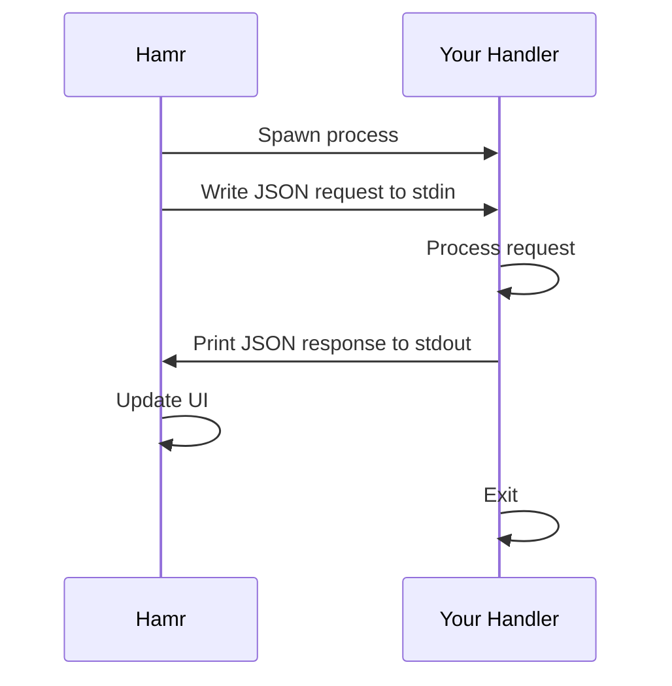
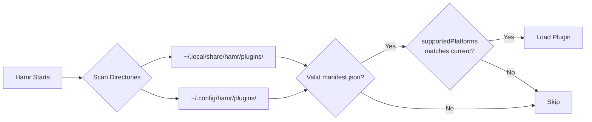

# Building Hamr Plugins

This guide will help you build your first Hamr plugin. Start here, then explore the detailed documentation as needed.

## What You'll Build

Hamr plugins extend the launcher with custom functionality. When you're done with this guide, you'll have created a working plugin that:

- Shows a list of items when opened
- Filters items as you type
- Executes an action when you select an item


## Quick Start: Your First Plugin

Let's build a "Hello World" plugin in under 5 minutes.

### Step 1: Create the Plugin Directory

Hamr loads plugins from two locations:

1. **Built-in plugins:** `~/.local/share/hamr/plugins/` (installed with Hamr)
2. **User plugins:** `~/.config/hamr/plugins/` (your custom plugins)

Create your plugin in the user directory:

```bash
mkdir -p ~/.config/hamr/plugins/hello
```

### Step 2: Create the Manifest

The manifest tells Hamr about your plugin. **Important:** You must specify `supportedPlatforms` or your plugin won't appear.

```bash
cat > ~/.config/hamr/plugins/hello/manifest.json << 'EOF'
{
  "name": "Hello",
  "description": "My first Hamr plugin",
  "icon": "waving_hand",
  "supportedPlatforms": ["niri", "hyprland"]
}
EOF
```

> **Note:** `supportedPlatforms` defines which platforms/compositors your plugin works with:
>
> - `["niri", "hyprland"]` - Linux Wayland compositors
> - `["hyprland"]` - Hyprland only (if you use `hyprctl`)
> - `["niri"]` - Niri only (if you use `niri msg`)
> - `["macos"]` - macOS
> - `["windows"]` - Windows
>
> List all platforms your plugin supports explicitly. There is no wildcard.
>
> **Note:** For stdio plugins, Hamr always runs `handler.py` in the plugin directory, so the `handler` field is optional. Use `handler.command` only for socket/daemon plugins.

### Step 3: Create the Handler

The handler is your plugin's logic. Create `~/.config/hamr/plugins/hello/handler.py`:

```python
#!/usr/bin/env python3
"""
Hamr Plugin Handler Template

Hamr communicates with plugins via JSON over stdin/stdout:
1. Hamr spawns your handler as a subprocess
2. Hamr writes a JSON request to your handler's stdin
3. Your handler reads the request, processes it, and prints a JSON response to stdout
4. Hamr reads the response and updates the UI

This stateless request-response model means each invocation is independent.
Use the `context` field to persist state across calls if needed.
"""
import json
import sys


def main():
    # Read the JSON request from stdin
    # Hamr sends the entire request as a single JSON object
    input_data = json.load(sys.stdin)

    # Extract common fields from the request
    step = input_data.get("step", "initial")      # What triggered this call
    query = input_data.get("query", "").strip()   # Search bar text (for search step)
    selected = input_data.get("selected", {})     # Selected item info (for action step)

    # Define our items (in a real plugin, this might come from a file or API)
    items = [
        {"id": "hello", "name": "Say Hello", "icon": "waving_hand", "description": "Show a greeting"},
        {"id": "goodbye", "name": "Say Goodbye", "icon": "door_open", "description": "Show a farewell"},
    ]

    # STEP: initial - Plugin just opened, show the initial view
    if step == "initial":
        print(json.dumps({
            "type": "results",
            "results": items,
            "placeholder": "Search greetings..."
        }))
        return

    # STEP: search - User is typing, filter results
    if step == "search":
        query_lower = query.lower()
        filtered = [i for i in items if query_lower in i["name"].lower()]
        print(json.dumps({
            "type": "results",
            "results": filtered
        }))
        return

    # STEP: action - User selected an item or clicked an action button
    if step == "action":
        item_id = selected.get("id", "")
        message = "Hello, World!" if item_id == "hello" else "Goodbye!"

        # Return an execute response to perform an action
        print(json.dumps({
            "type": "execute",
            "notify": message,  # Show a notification
            "close": True       # Close the launcher
        }))


if __name__ == "__main__":
    main()
```

### Step 4: Make it Executable

```bash
chmod +x ~/.config/hamr/plugins/hello/handler.py
```

### Step 5: Test Your Plugin

Open Hamr and search for "hello" to see your plugin in action.

**Tip:** If your plugin doesn't appear, check:

1. `supportedPlatforms` is set in manifest.json
2. The handler is executable (`chmod +x`)
3. Check logs: `journalctl --user -u hamr -f`

---

## How Plugins Work

### Communication Model

Plugins communicate with Hamr via **JSON over stdin/stdout**:



1. Hamr spawns your handler as a subprocess
2. Hamr writes a JSON request to your handler's stdin
3. Your handler processes the request
4. Your handler prints a JSON response to stdout
5. Hamr reads the response and updates the UI
6. The handler process exits

### The Request-Response Cycle

Every request includes a `step` field telling you what happened:

| Step      | When         | User Action                                 |
| --------- | ------------ | ------------------------------------------- |
| `initial` | Plugin opens | User selected the plugin                    |
| `search`  | User types   | Each keystroke (realtime) or Enter (submit) |
| `action`  | User selects | Clicked item or pressed Enter               |

### Plugin Discovery

Hamr scans these directories for plugins on startup:



**Key points:**

- Each plugin must have a `manifest.json`
- `supportedPlatforms` must include the current platform
- Handler must be executable with a valid shebang

### Directory Structure

```
~/.config/hamr/plugins/
├── my-plugin/
│   ├── manifest.json    # Plugin metadata (required)
│   └── handler.py       # Plugin logic (required)
```

---

## Core Concepts

### The Manifest File

Every plugin needs a `manifest.json`:

```json
{
  "name": "My Plugin",
  "description": "What it does",
  "icon": "star",
  "supportedPlatforms": ["niri", "hyprland"]
}
```

| Field                | Required | Description                                                  |
| -------------------- | -------- | ------------------------------------------------------------ |
| `name`               | Yes      | Display name                                                 |
| `description`        | Yes      | Short description                                            |
| `icon`               | Yes      | Material icon name                                           |
| `supportedPlatforms` | Yes      | `["niri", "hyprland"]`, `["macos"]`, etc. (list all explicitly) |
| `handler`            | No       | Handler config. Stdio plugins run `handler.py` by default; socket plugins use `handler.command`. |
| `frecency`           | No       | `"item"`, `"plugin"`, or `"none"` (default: `"item"`)        |

### Input (What You Receive)

```python
{
    "step": "initial|search|action",    # What happened
    "query": "user input",               # Search bar text (search step)
    "selected": {"id": "item-id"},       # Selected item (action step)
    "action": "button-id",               # Action button ID (action step, optional)
    "context": "your-state",             # Your custom state (persisted)
    "session": "session-id"              # Unique session identifier
}
```

The `action` field tells you which action button was clicked:

- **Not set:** User clicked the item itself (default action)
- **Set:** User clicked a specific action button (e.g., `"copy"`, `"delete"`)

### Output (What You Return)

Return **one** JSON object. The `type` field determines what Hamr does:

| Type      | Purpose           | Example                              |
| --------- | ----------------- | ------------------------------------ |
| `results` | Show a list       | Search results, menu items           |
| `execute` | Run an action     | Open file, copy text, close launcher |
| `card`    | Show rich content | Markdown text, definitions           |
| `error`   | Show error        | Something went wrong                 |

See [Response Types](response-types.md) for complete documentation.

### Multi-step Flows (Optional)

For drill-down workflows (edit screens, pickers), store state in `context` and control the stack with `navigateForward` and `navigateBack`. Handle `selected.id == "__back__"` to return to the previous view. See [Response Types](response-types.md) for examples.

---

## Language Support

Plugins can be written in any language. The handler just needs to:

1. Be executable (`chmod +x`)

2. Have a shebang (`#!/usr/bin/env python3`)

3. Read JSON from stdin

4. Write JSON to stdout

| Language    | Use Case                        |
| ----------- | ------------------------------- |
| **Python**  | Recommended for most plugins    |
| **Bash**    | Simple scripts, system commands |
| **Go/Rust** | Performance-critical plugins    |
| **Node.js** | Web API integrations            |

### Python (Recommended)

```python
#!/usr/bin/env python3
import json
import sys

def main():
    # Read JSON request from stdin (Hamr sends it all at once)
    input_data = json.load(sys.stdin)

    # Process and respond
    print(json.dumps({"type": "results", "results": [...]}))

if __name__ == "__main__":
    main()
```

### Bash

```bash
#!/bin/bash
INPUT=$(cat)
STEP=$(echo "$INPUT" | jq -r '.step // "initial"')

case "$STEP" in
    initial)
        echo '{"type": "results", "results": [{"id": "1", "name": "Item", "icon": "star"}]}'
        ;;
esac
```

### Node.js

```javascript
#!/usr/bin/env node
const fs = require("fs");
const input = JSON.parse(fs.readFileSync(0, "utf-8"));

if (input.step === "initial") {
  console.log(
    JSON.stringify({
      type: "results",
      results: [{ id: "1", name: "Item", icon: "star" }],
    }),
  );
}
```

---

## Next Steps

Now that you understand the basics:

1. **[Response Types](response-types.md)** - Learn about all response types (`results`, `execute`, `card`, `form`, etc.)

2. **[Visual Elements](visual-elements.md)** - Add sliders, switches, badges, gauges, and progress bars

3. **[Advanced Features](advanced-features.md)** - Pattern matching, daemon mode, indexing, search ranking

4. **[API Reference](api-reference.md)** - Complete schema reference for all fields and types

5. **[Cheat Sheet](cheatsheet.md)** - Quick reference for common patterns

---

## Built-in Plugin Examples

Study these plugins to learn common patterns:

| Plugin        | Features                                    | Good For Learning        |
| ------------- | ------------------------------------------- | ------------------------ |
| `calculate/`  | Pattern matching, instant results           | Main search integration  |
| `url/`        | Pattern matching, actions                   | Simple match handler     |
| `timer/`      | Daemon, FAB override, ambient items, status | Advanced daemon patterns |
| `quicklinks/` | CRUD, context, input modes                  | State management         |
| `todo/`       | Daemon, file watching, status               | Real-time updates        |
| `clipboard/`  | Thumbnails, filters, actions                | Rich UI                  |
| `bitwarden/`  | Forms, caching, entryPoint                  | Complex workflows        |
| `sound/`      | Sliders, switches, updates                  | Interactive controls     |
| `emoji/`      | Grid browser                                | Large item sets          |

---

## Development Mode

For plugin development, run Hamr in dev mode:

```bash
cd ~/path/to/hamr
./dev
```

Dev mode:

- Auto-reloads when plugin files change
- Shows logs directly in the terminal
- Displays errors in the UI

See [Testing Plugins](testing.md) for more details.

---

## Troubleshooting

### Plugin doesn't appear in Hamr

1. **Check `supportedPlatforms`** - Must be set in manifest.json

   ```json
   "supportedPlatforms": ["niri", "hyprland"]
   ```

2. **Check file permissions** - Handler must be executable

   ```bash
   chmod +x handler.py
   ```

3. **Check for JSON errors** - Validate your manifest

   ```bash
   jq . manifest.json
   ```

4. **Check logs** - See what Hamr reports
   ```bash
   # In dev mode, logs appear in terminal
   # Otherwise:
   journalctl --user -u hamr -f
   ```

### Plugin shows error

1. **Test manually** - Run your handler directly

   ```bash
   echo '{"step": "initial"}' | ./handler.py
   ```

2. **Check JSON output** - Must be valid JSON

   ```bash
   echo '{"step": "initial"}' | ./handler.py | jq .
   ```

3. **Check terminal/logs** - Errors appear in dev terminal or journalctl

---

## Tips for Success

1. **Use dev mode** - Run `./dev` for auto-reload and live logs
2. **Start simple** - Get basic results working before adding features
3. **Test visually** - Interact with your plugin; errors are shown in the UI
4. **Keep results under 50** - More items slow down the UI
5. **Use placeholder text** - Helps users know what to type
6. **Handle empty states** - Show helpful messages when no results match
7. **Desktop files** - If you read `.desktop` files, note that XDG defaults can point to `NoDisplay=true` entries
